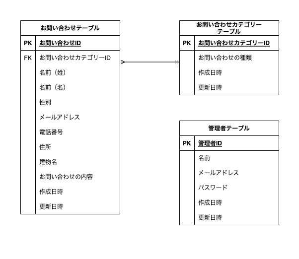

# contac

### 環境構築

##### Dockerビルド
  * docker-compose up -d --build    

##### Laravel環境構築
  1. docker-compose exec bash
  2. composer install
  3. .env　の環境変数を変更
  4. php artisan maigrate

### ER図
  

### 使用技術
 * PHP 8.3.0  
 * Laravel 8.83.27  
 * MySQL 8.0.26

### URL
 * 開発環境 ：　http://localhost/
 * phpMyAdmin : http://localhost:8080/

